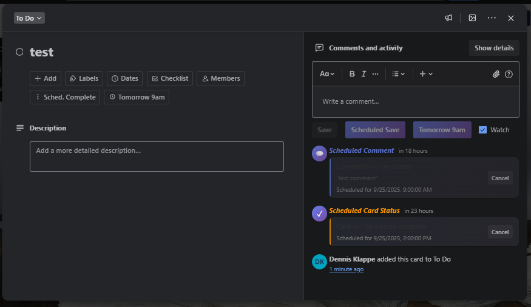

# Trello Comment Scheduler

I'm a full-time student and part-time web developer, causing me to often work evenings/nights on certain projects. Some clients don't like getting Trello updates at night, so I built this :)

Schedule comments and card completion status changes in Trello. Post comments at a future time, mark cards complete automatically.
## Features

- Schedule comments to be posted at specific times
- Schedule card completion status changes
- Quick scheduling options (5 min, 15 min, 1 hour, today at 1 PM, tomorrow at 9 AM/2 PM)
- Cancel scheduled items before they execute
- Visual indicators for scheduled items in card activity feed

## Screenshots

### Scheduling Buttons in Card


### Schedule Dialog


### Scheduled Items in Activity Feed


## How It Works

1. **Chrome Extension** adds scheduling buttons to Trello interface
2. **Cloudflare Worker** stores scheduled items and processes them every minute using an efficient minute-based index (no KV list operations)
3. **Trello API** posts comments and updates cards at scheduled times

## Setup Guide

### Prerequisites

- Trello account
- Cloudflare account (free tier works)
- Chrome browser

### Step 1: Get Trello Credentials

1. Get your Trello API key:
   - Visit: https://trello.com/power-ups/admin/
   - Click "New" to create a new Power-Up (name doesn't matter)
   - You can create it in any Workspace
   - Once created, click on your Power-Up
   - Copy the API key shown

2. Generate a Trello token:
   - Use this URL (replace YOUR_API_KEY with your actual API key):
   ```
   https://trello.com/1/authorize?expiration=never&scope=read,write&response_type=token&key=YOUR_API_KEY
   ```
   - This will open an authorization page
   - Click "Allow" to authorize
   - Copy the token shown on the success page

### Step 2: Deploy Cloudflare Worker

1. Install Wrangler CLI:
   ```bash
   npm install -g wrangler
   ```

2. Login to Cloudflare:
   ```bash
   wrangler login
   ```

3. Create KV namespace:
   ```bash
   wrangler kv:namespace create "TRELLO_SCHEDULES"
   ```
   Copy the ID from the output (it will look like: `id = "a1b2c3d4e5f6g7h8"`)

4. Update `worker/wrangler.toml`:
   - Replace `YOUR_KV_NAMESPACE_ID` with the ID you just copied
   - Replace `YOUR_TRELLO_API_KEY` with your Trello API key from Step 1

5. Deploy the worker:
   ```bash
   cd worker
   wrangler deploy
   ```
   Copy the worker URL (e.g., `https://trello-comment-scheduler.your-subdomain.workers.dev`)

### Step 3: Install Chrome Extension

1. Update extension configuration:
   - Open `chrome-extension/content.js`
   - Replace `https://your-worker-name.your-subdomain.workers.dev` with your worker URL

2. Load extension in Chrome:
   - Open Chrome and go to `chrome://extensions`
   - Enable "Developer mode"
   - Click "Load unpacked"
   - Select the `chrome-extension` folder

3. Set your Trello token:
   - Open any Trello board
   - Open browser console (F12)
   - Run the following command, replacing `YOUR_TRELLO_TOKEN` with the token you got from Step 1.2:
   ```javascript
   localStorage.setItem('trello_auth_token', 'YOUR_TRELLO_TOKEN')
   ```
   - You should see `undefined` returned (this is normal)
   - The token is now saved for the extension to use

## Usage

### Schedule a Comment

1. Open a Trello card
2. Type your comment
3. Click "Scheduled Save" or "Tomorrow 9am"
4. Select time and confirm

### Schedule Card Completion

1. Open a Trello card
2. Look for schedule buttons in the sidebar
3. Click "Sched. Complete" or "Tomorrow 9am"
4. Select time and confirm

### Cancel Scheduled Items

1. Scheduled items appear in the card's activity feed
2. Click "Cancel" button next to any scheduled item
3. Confirm cancellation

## Project Structure

```
├── chrome-extension/
│   ├── manifest.json       # Extension configuration
│   ├── content.js         # Main extension logic
│   └── styles.css         # UI styles
├── worker/
│   ├── index.js           # Cloudflare Worker code
│   └── wrangler.toml      # Worker configuration
└── README.md
```

## API Endpoints

### POST /schedule
Schedule a comment or card update
```json
{
  "cardId": "abc123",
  "comment": "Optional comment text",
  "scheduledTime": "2024-12-25T09:00:00Z",
  "markComplete": true,
  "trelloToken": "user_token"
}
```

### POST /cancel
Cancel a scheduled item
```json
{
  "key": "schedule_key",
  "trelloToken": "user_token"
}
```

### GET /process
Manually trigger processing (for testing)

## Troubleshooting

### Extension not showing buttons
- Refresh the Trello page
- Check extension is enabled in Chrome
- Verify worker URL is correctly set

### Scheduled items not posting
- Check worker logs: `wrangler tail`
- Verify Trello token is valid
- Ensure worker cron trigger is active

### Token errors
- Token may have expired
- Generate a new token and update localStorage
- Ensure token has write permissions

### Cloudflare KV rate limits
- The worker uses a minute-based indexing systemto avoids KV list operations
- If you see 429 errors, check your KV usage in Cloudflare dashboard
- The free tier supports 100,000 reads, 1,000 writes, and 1,000 deletes per day

## Security Notes

- Trello tokens are stored in browser localStorage
- Each user uses their own token
- Worker validates tokens before processing
- Scheduled items expire after 7 days

## Development

### Local Testing

1. Run worker locally:
   ```bash
   cd worker
   wrangler dev
   ```

2. Update extension to use local URL:
   ```javascript
   const WORKER_URL = 'http://localhost:8787';
   ```

### Contributing

1. Fork the repository
2. Create feature branch
3. Make changes
4. Test thoroughly
5. Submit pull request

## Author

Created by Dennis Klappe
- Website: [klappe.dev](https://klappe.dev)
- GitHub: [@dennisklappe](https://github.com/dennisklappe/)

## License

MIT License - See LICENSE file for details